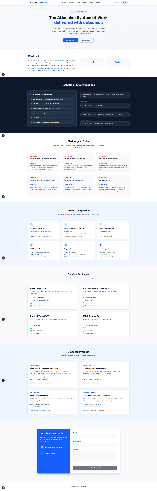

# Oleksandr Tolochko - Atlassian Portfolio

A modern, responsive portfolio website showcasing Atlassian expertise.



## Features

- **Bilingual Support** - English and Ukrainian via `?lang=en|uk`
- **Dark/Light Mode** - Toggle in navbar, persisted via `next-themes`
- **Contact Form** - Server-side API with honeypot protection
- **Responsive Design** - Mobile-first with Tailwind CSS
- **Smooth Animations** - Scroll-triggered reveals

## Tech Stack

- **Framework**: Next.js 16 (App Router, Turbopack)
- **Styling**: Tailwind CSS v4 with Zinc/Blue palette
- **Icons**: Lucide React
- **Fonts**: Manrope + JetBrains Mono (Google Fonts)
- **Theme**: `next-themes` for dark mode

## Getting Started

```bash
npm install
npm run dev
```

Open [http://localhost:3000](http://localhost:3000)

## Commands

| Command         | Description           |
| --------------- | --------------------- |
| `npm run dev`   | Start dev server      |
| `npm run build` | Production build      |
| `npm run start` | Run production server |
| `npm run lint`  | Run ESLint            |

## Project Structure

```
app/
├── components/
│   ├── sections/     # Page sections (Hero, Projects, Contact, etc.)
│   └── ui/           # Reusable UI (Button, ThemeToggle)
├── api/contact/      # Contact form API route
├── i18n.ts           # EN/UK translations
├── globals.css       # Design tokens & dark mode
├── providers.tsx     # Theme provider
└── page.tsx          # Homepage composition
```

## Deployment

Deploy on [Vercel](https://vercel.com) or any Node.js platform.
